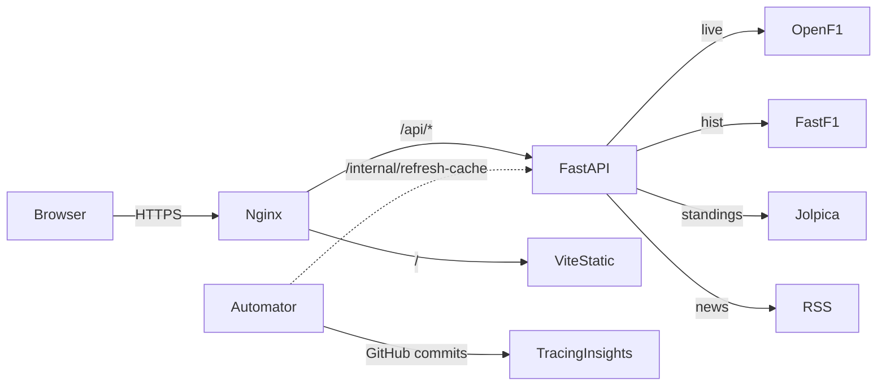

# F1 Demo — A-to-Z v1.0 Completion Prompt

> **How to use this file in VS Code:**
> 1. Open VS Code at the repo root: `code /home/krishnanantha/f1demo`.
> 2. Open the Copilot Chat (or Cursor / Continue) sidebar.
> 3. Paste the contents of this file from the next `---` divider down as the first message.
> 4. Work top-to-bottom. Each phase has its own *Goal*, *Files*, *Tasks*, and *Verify* block —
>    finish a phase before moving to the next.
> 5. When the **Final v1.0 acceptance block** at the bottom is fully green, the app is done.
>
> **Prerequisite (already done):**
> - `f1demo/AUDIT.md` Phase 0 hard blockers fixed (see `PHASE_0_COMPLETE.md`).
> - `f1demo/REMEDIATION_PROMPT.md` Steps 1–11 executed: shared limiter, circuit-data path
>   fixed, in-process cache clear, news dedup tests, route timezone hardening, UI/UX polish
>   (reduced-motion, focus-visible, skip-link, route-frame, FlipValue, Toast, ARIA).
> - Backend 27/27 tests pass; frontend lint clean, 18/18 vitest pass, build < 1 s.
>
> Everything below builds on that baseline and takes the app to a shippable v1.0.

---

You are working in `/home/krishnanantha/f1demo`. Working tree is the nested `f1demo/`. Match the
existing conventions: FastAPI + Zustand + Vite + React 19, CSS variables in `:root`, classes like
`var(--ease-out-expo)`, route-modular backend, page-modular frontend. Prefer the smallest viable
diff. After each phase, re-run the verify block and only then move on.

---

## Phase A — Workspace setup (VS Code first run, ~10 min)

**Goal:** Establish a deterministic, low-friction dev loop in VS Code.

### A.1 Recommended extensions

**File:** create `f1demo/.vscode/extensions.json`
```json
{
  "recommendations": [
    "ms-python.python",
    "ms-python.vscode-pylance",
    "charliermarsh.ruff",
    "dbaeumer.vscode-eslint",
    "esbenp.prettier-vscode",
    "bradlc.vscode-tailwindcss",
    "stylelint.vscode-stylelint",
    "redhat.vscode-yaml",
    "GitHub.vscode-pull-request-github",
    "eamodio.gitlens",
    "streetsidesoftware.code-spell-checker"
  ]
}
```

### A.2 Workspace settings

**File:** replace `f1demo/.vscode/settings.json` with:
```json
{
  "editor.formatOnSave": true,
  "editor.codeActionsOnSave": {
    "source.fixAll.eslint": "explicit",
    "source.organizeImports": "explicit"
  },
  "[python]": {
    "editor.defaultFormatter": "charliermarsh.ruff",
    "editor.formatOnSave": true,
    "editor.codeActionsOnSave": { "source.fixAll": "explicit" }
  },
  "[javascript]": { "editor.defaultFormatter": "esbenp.prettier-vscode" },
  "[javascriptreact]": { "editor.defaultFormatter": "esbenp.prettier-vscode" },
  "[json]": { "editor.defaultFormatter": "esbenp.prettier-vscode" },
  "[markdown]": { "editor.defaultFormatter": "esbenp.prettier-vscode" },
  "python.defaultInterpreterPath": "${workspaceFolder}/f1demo/.venv/bin/python",
  "python.testing.pytestEnabled": true,
  "python.testing.pytestArgs": ["f1demo/backend/tests"],
  "eslint.workingDirectories": ["f1demo/frontend"],
  "files.exclude": {
    "**/__pycache__": true,
    "**/.pytest_cache": true,
    "**/node_modules": true,
    "**/dist": true,
    "**/.vite": true
  },
  "search.exclude": {
    "**/node_modules": true,
    "**/dist": true,
    "**/.venv": true,
    "**/cache": true,
    "**/*.log": true
  }
}
```

### A.3 Tasks

**File:** create `f1demo/.vscode/tasks.json`
```json
{
  "version": "2.0.0",
  "tasks": [
    {
      "label": "backend: pytest",
      "type": "shell",
      "command": "${workspaceFolder}/f1demo/.venv/bin/python -m pytest -q backend/tests",
      "options": { "cwd": "${workspaceFolder}/f1demo" },
      "group": { "kind": "test", "isDefault": true },
      "presentation": { "reveal": "always", "panel": "dedicated" }
    },
    {
      "label": "backend: dev server",
      "type": "shell",
      "command": "${workspaceFolder}/f1demo/.venv/bin/python -m uvicorn main:app --reload --port 8000",
      "options": { "cwd": "${workspaceFolder}/f1demo/backend" },
      "isBackground": true,
      "problemMatcher": []
    },
    {
      "label": "frontend: dev server",
      "type": "shell",
      "command": "npm run dev",
      "options": { "cwd": "${workspaceFolder}/f1demo/frontend" },
      "isBackground": true,
      "problemMatcher": []
    },
    {
      "label": "frontend: lint",
      "type": "shell",
      "command": "npm run lint",
      "options": { "cwd": "${workspaceFolder}/f1demo/frontend" },
      "group": "test"
    },
    {
      "label": "frontend: build",
      "type": "shell",
      "command": "npm run build",
      "options": { "cwd": "${workspaceFolder}/f1demo/frontend" },
      "group": "build"
    },
    {
      "label": "all: ci-equivalent",
      "dependsOrder": "sequence",
      "dependsOn": ["backend: pytest", "frontend: lint", "frontend: build"]
    }
  ]
}
```

### A.4 Launch / debug

**File:** create `f1demo/.vscode/launch.json`
```json
{
  "version": "0.2.0",
  "configurations": [
    {
      "name": "FastAPI: backend (debug)",
      "type": "debugpy",
      "request": "launch",
      "module": "uvicorn",
      "args": ["main:app", "--reload", "--port", "8000"],
      "cwd": "${workspaceFolder}/f1demo/backend",
      "python": "${workspaceFolder}/f1demo/.venv/bin/python",
      "justMyCode": false
    },
    {
      "name": "Pytest: current file",
      "type": "debugpy",
      "request": "launch",
      "module": "pytest",
      "args": ["${file}", "-v"],
      "cwd": "${workspaceFolder}/f1demo",
      "python": "${workspaceFolder}/f1demo/.venv/bin/python"
    }
  ]
}
```

### A.5 Pre-commit hooks

**File:** create `f1demo/.pre-commit-config.yaml`
```yaml
repos:
  - repo: https://github.com/astral-sh/ruff-pre-commit
    rev: v0.6.9
    hooks:
      - id: ruff
        args: [--fix]
        files: ^f1demo/backend/.*\.py$
      - id: ruff-format
        files: ^f1demo/backend/.*\.py$
  - repo: https://github.com/pre-commit/pre-commit-hooks
    rev: v4.6.0
    hooks:
      - id: trailing-whitespace
      - id: end-of-file-fixer
      - id: check-yaml
      - id: check-added-large-files
        args: ["--maxkb=512"]
  - repo: local
    hooks:
      - id: eslint
        name: eslint
        entry: bash -c 'cd f1demo/frontend && npx eslint --max-warnings=0'
        language: system
        files: ^f1demo/frontend/src/.*\.(js|jsx)$
        pass_filenames: false
```
Add `ruff` to `f1demo/backend/requirements-dev.txt` and run:
```bash
pip install pre-commit ruff && pre-commit install
```

**Verify:**
- `Cmd/Ctrl+Shift+B` runs the backend tests.
- `pre-commit run --all-files` passes (or only flags pre-existing whitespace, fix and commit).

---

## Phase B — Production hardening (~3 h)

**Goal:** Stop assuming "changeme-in-production" is fine. Real env handling, structured logging,
observability, and CORS behavior that's safe in prod.

### B.1 Real secret management

**File:** `f1demo/backend/utils.py`
- Replace the default `INTERNAL_SECRET = os.getenv("INTERNAL_SECRET", "changeme-in-production")`
  with: refuse to start in production unless the env is set.
```python
INTERNAL_SECRET = os.getenv("INTERNAL_SECRET")
APP_ENV = os.getenv("APP_ENV", "development")
if APP_ENV == "production" and (not INTERNAL_SECRET or INTERNAL_SECRET == "changeme-in-production"):
    raise RuntimeError("INTERNAL_SECRET must be set in production (and not equal to the default).")
if not INTERNAL_SECRET:
    INTERNAL_SECRET = "changeme-in-development"  # dev only
```
Mirror the same change in `backend/automator.py` so the daemon refuses to send a placeholder
secret in production.

**File:** `f1demo/.env.example`
Document every env variable the app actually reads. Audit `grep -r 'os.getenv' f1demo/backend`
and ensure each appears in the example with a comment.

### B.2 CORS lockdown in production

**File:** `f1demo/backend/main.py`
- When `APP_ENV == "production"` and `ALLOWED_ORIGINS` is empty, raise on startup.
- Strip `localhost` defaults out of the production fallback list.

### B.3 Structured request logging

**File:** create `f1demo/backend/middleware/logging.py`
```python
"""Request/response timing + structured log middleware."""
import logging
import time
import uuid
from starlette.middleware.base import BaseHTTPMiddleware

logger = logging.getLogger("f1dashboard.request")


class RequestLogMiddleware(BaseHTTPMiddleware):
    async def dispatch(self, request, call_next):
        rid = request.headers.get("x-request-id") or uuid.uuid4().hex[:12]
        request.state.request_id = rid
        start = time.perf_counter()
        try:
            response = await call_next(request)
        except Exception:
            logger.exception("rid=%s %s %s -> EXCEPTION", rid, request.method, request.url.path)
            raise
        elapsed_ms = (time.perf_counter() - start) * 1000
        logger.info(
            "rid=%s %s %s -> %s in %.1fms",
            rid, request.method, request.url.path, response.status_code, elapsed_ms,
        )
        response.headers["x-request-id"] = rid
        return response
```
Wire it in `main.py`:
```python
from middleware.logging import RequestLogMiddleware
app.add_middleware(RequestLogMiddleware)
```
Create `f1demo/backend/middleware/__init__.py` (empty file) so it's a package.

### B.4 Optional Sentry integration (gated by env)

**File:** `f1demo/backend/main.py` — top of file, after imports:
```python
_sentry_dsn = os.getenv("SENTRY_DSN")
if _sentry_dsn:
    try:
        import sentry_sdk
        sentry_sdk.init(dsn=_sentry_dsn, traces_sample_rate=0.1, environment=APP_ENV)
    except ImportError:
        logger.warning("SENTRY_DSN set but sentry_sdk not installed; skipping")
```
Add `sentry-sdk` to `requirements.txt` only if the user opts in; otherwise leave it commented in
`requirements-dev.txt` to keep prod dependencies lean.

### B.5 Backend rate limits on hot routes

Apply `@limiter.limit("...")` (the shared limiter) to `routes/telemetry.py` (`/laps`, `/telemetry`,
`/compare`) at 60/minute, and to `routes/ti.py` heavy endpoints at 60/minute. Add `request: Request`
parameter where missing.

### B.6 Health-check semantics

**File:** `f1demo/backend/routes/health.py`
- Add a `state_age_seconds > 600` rule that flips `status` to `"degraded"` (not `"ok"`) so a stuck
  automator is visible to load balancers.
- Return `Cache-Control: no-store` on `/health`.

**Verify:**
```bash
cd f1demo && ./.venv/bin/python -m pytest -q backend/tests
APP_ENV=production ./.venv/bin/python -c "from backend import main"   # must raise without secret
```

---

## Phase C — Test coverage to ≥ 80 % (~6 h)

**Goal:** Establish a safety net before refactors. Use coverage as the metric, not a vibe.

### C.1 Backend coverage tooling

**File:** `f1demo/backend/requirements-dev.txt` — add:
```
pytest-cov>=4.1.0
ruff>=0.6.0
```
**File:** `f1demo/pytest.ini` — replace with:
```ini
[pytest]
pythonpath = . backend
addopts = --cov=backend --cov-report=term-missing --cov-fail-under=80
asyncio_mode = auto
```
Fix the failure: most untested branches are in `services/news_service.py` (network paths) and
`routes/telemetry.py`. Add tests:

- `backend/tests/test_telemetry_validation.py` — 400s for bad year/session/driver.
- `backend/tests/test_health.py` — `state_age_seconds > 600` flips status.
- `backend/tests/test_schedule.py` — mock FastF1 and assert tz handling on `next_race`.
- Extend `backend/tests/test_news_service.py` — cover empty feeds, network errors, image
  extraction (`media_content`, `enclosures`), summary truncation at 300 chars.
- Extend `backend/tests/test_live_stream.py` — cover `openf1_json_tail` edge cases (single dict,
  empty list, 500 status) and `_compute_delay` saturation at `max_interval`.

### C.2 Frontend component coverage

**File:** `f1demo/frontend/package.json` — add `"test:coverage": "vitest run --coverage"`.
**File:** `f1demo/frontend/vite.config.js` — add coverage to the test block:
```js
test: {
  globals: true,
  environment: 'jsdom',
  setupFiles: ['./src/__tests__/setup.js'],
  coverage: {
    provider: 'v8',
    reporter: ['text', 'html'],
    thresholds: { lines: 70, statements: 70, functions: 60, branches: 55 },
    exclude: ['**/node_modules/**', 'src/**/__tests__/**', '**/*.config.js'],
  },
}
```
Install `npm i -D @vitest/coverage-v8`. Add tests for:
- `Toast` keyboard dismissal, multiple stacking
- `Sidebar` `aria-expanded` flips
- `LiveCompanion` renders waiting state, then position rows, then dismisses alert
- `Loading`, `Skeleton`, `PageSkeleton` accessible roles
- `useWebSocket` exponential backoff progression

### C.3 End-to-end with Playwright

**File:** `f1demo/frontend/package.json`:
```
"@playwright/test": "^1.47.0"
```
**File:** create `f1demo/frontend/playwright.config.js`
```js
import { defineConfig, devices } from '@playwright/test';
export default defineConfig({
  testDir: './e2e',
  fullyParallel: true,
  retries: 1,
  use: { baseURL: 'http://localhost:5173', trace: 'on-first-retry' },
  projects: [
    { name: 'chromium', use: { ...devices['Desktop Chrome'] } },
    { name: 'firefox',  use: { ...devices['Desktop Firefox'] } },
    { name: 'webkit',   use: { ...devices['Desktop Safari'] } },
  ],
  webServer: { command: 'npm run dev', url: 'http://localhost:5173', reuseExistingServer: true },
});
```
**File:** create `f1demo/frontend/e2e/smoke.spec.js`
```js
import { test, expect } from '@playwright/test';

test('dashboard renders without console errors', async ({ page }) => {
  const errors = [];
  page.on('pageerror', (e) => errors.push(e.message));
  page.on('console', (m) => { if (m.type() === 'error') errors.push(m.text()); });
  await page.goto('/');
  await expect(page.getByText('F1', { exact: true })).toBeVisible();
  await page.keyboard.press('Tab');
  await expect(page.getByRole('link', { name: /skip to content/i })).toBeFocused();
  expect(errors).toEqual([]);
});

test('keyboard nav reaches every sidebar link', async ({ page }) => {
  await page.goto('/');
  for (const label of ['Dashboard', 'Drivers', 'Constructors', 'Calendar', 'Analysis', 'Telemetry', 'News Feed']) {
    await expect(page.getByRole('link', { name: label })).toBeVisible();
  }
});
```
Add `npm run test:e2e: "playwright test"`. Wire it into CI as a separate job that runs only on
PRs (cost-aware).

**Verify:**
```bash
cd f1demo && ./.venv/bin/python -m pytest -q backend/tests   # green at >=80% coverage
cd frontend && npm run test:coverage                          # green at thresholds above
cd frontend && npx playwright install --with-deps && npm run test:e2e
```

---

## Phase D — Frontend module split (~10 h)

**Goal:** No source file > 600 LOC; each page is a directory with index.jsx + sibling pieces.
This is the biggest refactor. Do **one page per commit** to keep diffs reviewable.

Current sizes (verified):
- `pages/Telemetry.jsx` 1282
- `pages/RaceDetail.jsx` 975
- `pages/Analysis.jsx` 873
- `pages/Dashboard.jsx` 662
- `pages/Drivers.jsx` 513
- `pages/Constructors.jsx` 497
- `pages/Calendar.jsx` 461

### D.1 Split pattern

For each large page, e.g. `Telemetry.jsx`, restructure to:
```
pages/telemetry/
├── index.jsx                 # default export, ~150 LOC: state, layout, error boundary
├── components/
│   ├── DriverPicker.jsx
│   ├── LapSelector.jsx
│   ├── TelemetryChart.jsx    # the multi-channel chart
│   ├── SectorTable.jsx
│   └── ComparisonStrip.jsx
├── hooks/
│   ├── useTelemetryData.js   # owns the api.telemetry call + memoization
│   └── useLapPicker.js
└── utils/
    └── lttb.js               # downsampling helper used by TelemetryChart
```
The existing barrel modules (`pages/telemetry/index.js`) already lazy-load through
`App.jsx`; rename `index.js` to `index.jsx` and have it re-export the new `index.jsx`. The
`App.jsx` import does not change.

### D.2 LTTB downsampling on the backend

Telemetry can return tens of thousands of points; the chart can't handle it. Add server-side
downsampling so the wire payload stays under ~2000 points.

**File:** create `f1demo/backend/services/downsample.py`
```python
"""Largest-Triangle-Three-Buckets downsampling for telemetry.

References:
- Steinarsson, Sveinn (2013). "Downsampling Time Series for Visual Representation."
"""
from __future__ import annotations
import math
from typing import Sequence


def lttb(data: Sequence[tuple[float, float]], threshold: int) -> list[tuple[float, float]]:
    """Reduce `data` (list of (x, y)) to at most `threshold` points using LTTB."""
    n = len(data)
    if threshold >= n or threshold <= 2:
        return list(data)
    every = (n - 2) / (threshold - 2)
    sampled = [data[0]]
    a = 0
    for i in range(threshold - 2):
        avg_range_start = int(math.floor((i + 1) * every) + 1)
        avg_range_end = int(math.floor((i + 2) * every) + 1)
        avg_range_end = min(avg_range_end, n)
        avg_x = sum(p[0] for p in data[avg_range_start:avg_range_end]) / max(1, avg_range_end - avg_range_start)
        avg_y = sum(p[1] for p in data[avg_range_start:avg_range_end]) / max(1, avg_range_end - avg_range_start)
        range_offs = int(math.floor(i * every) + 1)
        range_to = int(math.floor((i + 1) * every) + 1)
        max_area = -1.0
        next_a = range_offs
        ax, ay = data[a]
        for j in range(range_offs, range_to):
            x, y = data[j]
            area = abs((ax - avg_x) * (y - ay) - (ax - x) * (avg_y - ay)) * 0.5
            if area > max_area:
                max_area = area
                next_a = j
        sampled.append(data[next_a])
        a = next_a
    sampled.append(data[-1])
    return sampled
```
Wire it into `routes/telemetry.get_telemetry`:
```python
from services.downsample import lttb
...
records = sampled.to_dict(orient="records")
if len(records) > 2000:
    pts = [(r["Time"].total_seconds() if hasattr(r["Time"], "total_seconds") else float(r["Time"]), r["Speed"]) for r in records]
    keep_idx = {pts.index(p) for p in lttb(pts, 2000)}
    records = [r for i, r in enumerate(records) if i in keep_idx]
return records
```
Add `backend/tests/test_downsample.py` covering: identity (n ≤ threshold), strict cap (output
length ≤ threshold), endpoints preserved, monotonicity preserved on linear input.

### D.3 Style scoping

After splitting a page, move the page-specific CSS into `pages/<page>/styles.css` and import it
from `index.jsx`. Phase E will tackle the global stylesheet break-up.

**Verify per page:**
- `wc -l pages/<page>/index.jsx` < 200, every sibling < 400.
- `npm test` passes.
- Manual: navigate to the route, open DevTools, no console errors, all charts render.

---

## Phase E — CSS extraction (~6 h)

**Goal:** Replace the 4080-line `styles.css` monolith with a token core + per-component sheets.
Keep visual parity (zero design changes during this phase).

### E.1 Tokens core

**File:** create `f1demo/frontend/src/styles/tokens.css`. Move the entire `:root { … }` block and
keyframes into it. Then split the rest:

```
src/styles/
├── tokens.css        # :root vars + keyframes + reset (* { box-sizing })
├── base.css          # body, ::selection, focus-visible, skip-link, sr-only, smooth scroll
├── layout.css        # .app-layout, .main-wrapper, .content, responsive media queries
├── sidebar.css       # .sidebar, .sidebar-icon, hamburger
├── live.css          # .live-companion-v2, .lc-* rules
├── toast.css         # .toast-host, .toast variants
├── skeleton.css      # .skeleton-shimmer, .page-skeleton
└── index.css         # @import each of the above in dependency order
```

For component-scoped styles that survive (cards, charts, news, race-detail), move them into
`src/components/<name>/<Name>.module.css` (CSS Modules) or keep them in the per-page split from
Phase D. Aim: `styles.css` ends up empty and is deleted.

### E.2 Drop `styles.overrides.css` once merged

After all overrides land in their proper homes, delete `styles.overrides.css` and remove the
import from `main.jsx`.

### E.3 Visual regression sanity

Add a Playwright visual snapshot for the dashboard pre- and post-split:
```js
test('dashboard visual baseline', async ({ page }) => {
  await page.goto('/');
  await expect(page).toHaveScreenshot({ maxDiffPixelRatio: 0.01 });
});
```
Capture the baseline before E.1, then re-run after each split.

**Verify:** `wc -l f1demo/frontend/src/styles.css` returns 0 (file deleted) and the snapshot test
passes.

---

## Phase F — Phase-2 dashboard glance-first redesign (~5 h)

**Goal:** Above-the-fold renders in ≤ 1 s and answers the four canonical questions:
*What's happening now? · Who's leading? · When is the next session? · What changed today?*

### F.1 Independent widget loading

**File:** `f1demo/frontend/src/hooks/useAppInit.js`
Drop the `Promise.all`. Each widget owns its own `useEffect` and fetches independently. Standings,
roster, next-race, last-results, session-mode all load in parallel without blocking each other.

### F.2 Skeleton-per-widget

Each widget on the dashboard renders its own `Skeleton` row(s) until its data arrives. The
`Loading` spinner should not appear above the fold.

### F.3 Four-pane layout

Restructure `pages/dashboard/index.jsx` so the first paint is:
```
┌──────────────────────────┬──────────────────────┐
│ LIVE / NEXT countdown    │ Driver standings top │
│ (LiveCompanion or banner)│ 5 with FlipValue gaps│
├──────────────────────────┼──────────────────────┤
│ Last race podium         │ News headlines (4)   │
└──────────────────────────┴──────────────────────┘
```
Below the fold: full standings, weekend radar, weather strip, etc.

### F.4 Performance budget

**File:** `f1demo/frontend/vite.config.js` — add a build size warning:
```js
build: {
  chunkSizeWarningLimit: 250,
  rollupOptions: {
    output: { manualChunks: { react: ['react','react-dom'], router: ['react-router-dom'] } },
  },
},
```
Run `npm run build` and confirm the dashboard route chunk is < 60 kB gzip.

**Verify:**
- Lighthouse "Performance" ≥ 90 on the dashboard route (mobile preset).
- Network tab in DevTools: dashboard renders FCP < 1 s on a fast 3G profile.

---

## Phase G — Phase-3 news intelligence (~8 h)

**Goal:** Replace the dedup-by-title baseline with an entity-aware, clustered, personalized feed.

### G.1 Entity extraction (server-side, lightweight)

**File:** create `f1demo/backend/services/news_entities.py`
- Maintain a curated lexicon of drivers, teams, circuits in `backend/data/lexicon.json`. Build it
  from the same circuits.json + a new `drivers.json` (year-aware).
- `extract_entities(title: str, summary: str) -> {drivers: [...], teams: [...], circuits: [...]}`
  using simple case-insensitive substring matching (avoid an NLP dep).

### G.2 Clustering

In `services/news_service.fetch_news`, after dedup-by-title:
- Compute a stable cluster key from leading entities (e.g. `hamilton+mercedes` or
  `bahrain+gp:race`).
- Group articles sharing a cluster key; expose a `cluster_id` per article.
- Return the head article per cluster plus a `related: [...]` field with the rest.

### G.3 Trending widget endpoint

Add `GET /api/news/trending` returning the top 5 entities by mention count over the last 24 h.

### G.4 Frontend rewrite

Split `pages/NewsFeed.jsx` (already 283 LOC, manageable) into:
```
pages/news/
├── index.jsx                # layout, infinite scroll, entity chip filters
├── components/
│   ├── ArticleCard.jsx
│   ├── EntityChips.jsx
│   ├── ClusterPanel.jsx     # head article + collapsible related list
│   └── TrendingWidget.jsx
└── hooks/
    ├── useInfiniteNews.js   # cursor-based pagination
    └── useFavorites.js      # localStorage-backed favorites
```
Wire `IntersectionObserver` for infinite scroll. `EntityChips` filters by clicked driver/team/
circuit, with `aria-pressed` toggling on the chip.

### G.5 Stale-while-revalidate

In `useInfiniteNews`, on focus return, re-fetch the first page and merge new clusters at top
without scrolling the user.

### G.6 Tests

Extend `backend/tests/test_news_service.py`:
- entity extraction returns expected drivers/teams.
- two articles with the same cluster key collapse into one head with related.
- trending endpoint returns sorted descending counts.

**Verify:** `npm run test:e2e` includes a news-page e2e: filter by Hamilton chip, scroll, related
articles expand/collapse, no console errors.

---

## Phase H — Phase-6 live reliability (~3 h)

**Goal:** WebSocket survives any failure mode; degrade gracefully to SSE; expose latency stats.

### H.1 SSE fallback

**File:** create `f1demo/backend/routes/live_sse.py`
```python
"""Server-Sent Events fallback for environments where WebSocket is blocked."""
import asyncio, json
from fastapi import APIRouter, Request
from fastapi.responses import StreamingResponse
from utils import OPENF1, OPENF1_AUTH_ENABLED, _openf1_headers
from services.live_stream import openf1_json_tail
import httpx

router = APIRouter()


@router.get("/live/sse")
async def live_sse(request: Request, session_key: str = "latest"):
    async def event_stream():
        while not await request.is_disconnected():
            try:
                headers = await _openf1_headers()
                async with httpx.AsyncClient(timeout=8.0) as client:
                    pos = await client.get(f"{OPENF1}/positions?session_key={session_key}", headers=headers)
                    payload = {"positions": openf1_json_tail(pos, 120)}
                yield f"data: {json.dumps(payload)}\n\n"
            except Exception as exc:
                yield f"event: error\ndata: {json.dumps({'message': str(exc)})}\n\n"
            await asyncio.sleep(8)
    return StreamingResponse(event_stream(), media_type="text/event-stream")
```
Mount in `main.py` under `/api`. Test with `curl -N http://localhost:8000/api/live/sse`.

### H.2 Frontend fallback

**File:** `f1demo/frontend/src/hooks/useWebSocket.js`
After `MAX_RETRIES` (e.g. 4) consecutive WebSocket failures, switch to `EventSource` against
`/api/live/sse?session_key=…`. Expose a `mode` field (`"ws" | "sse" | "offline"`) to consumers.

### H.3 Latency tracking

The WebSocket payload already carries `timestamp`. In `LiveCompanion.jsx`, compute
`Date.now() - timestamp` for the last received frame and display it in the footer
(e.g. `"OpenF1 · 1.2 s ago"`). Also report it via `console.debug` so dev can graph it.

**Verify:** disable WebSockets in DevTools → Network → "Disable Cache + Block WS frames" and
confirm the LiveCompanion still updates within 10 s using SSE.

---

## Phase I — PWA, settings page, theming (~4 h)

**Goal:** Installable, offline-capable shell; user preferences land in a real surface.

### I.1 PWA manifest + service worker

Use `vite-plugin-pwa`:
```bash
cd f1demo/frontend && npm i -D vite-plugin-pwa
```
**File:** `f1demo/frontend/vite.config.js`
```js
import { VitePWA } from 'vite-plugin-pwa';
export default defineConfig({
  plugins: [
    react(),
    VitePWA({
      registerType: 'autoUpdate',
      includeAssets: ['favicon.svg'],
      manifest: {
        name: 'F1 Dashboard',
        short_name: 'F1',
        description: 'Live F1 timing, telemetry, standings.',
        theme_color: '#09090b',
        background_color: '#09090b',
        display: 'standalone',
        icons: [
          { src: '/favicon.svg', sizes: 'any', type: 'image/svg+xml' },
        ],
      },
      workbox: {
        runtimeCaching: [
          { urlPattern: /\/api\/(?:circuit-map|season|bios)/, handler: 'StaleWhileRevalidate' },
          { urlPattern: /\/api\/(?:standings|schedule)/, handler: 'NetworkFirst' },
        ],
      },
    }),
  ],
});
```

### I.2 Settings page

**File:** create `f1demo/frontend/src/pages/settings/index.jsx`
Surface:
- Theme toggle (dark / system) — `data-theme` on `<html>`, with `[data-theme=light]` overrides
  defined in `styles/themes/light.css` (small set of tokens flipping; do not invert images).
- Live polling interval slider (5–30 s) → update Zustand and `useWebSocket`.
- Notifications enable/disable (already exists in `useNotifications.js`).
- Reset all preferences (clears `localStorage`, reloads).

Add a route `/settings` and a sidebar entry. Persist via `zustand/middleware` `persist`.

### I.3 Light theme

**File:** create `f1demo/frontend/src/styles/themes/light.css` and import it last in
`styles/index.css`. Override `--bg-darkest`, `--bg-dark`, `--bg-card`, `--text`, `--text-muted`,
`--border`, `--bg-card-glass` for `[data-theme="light"]`. Keep `--f1-red` constant.

**Verify:**
- Lighthouse PWA score ≥ 90 on the dashboard.
- Toggling theme is instant and persists across reload.
- DevTools → Application → Service Workers shows the worker registered and caching API responses.

---

## Phase J — Performance budget enforcement (~3 h)

**Goal:** Bundle size and runtime stay measurable; no silent regressions.

### J.1 Bundle analyzer

```bash
cd f1demo/frontend && npm i -D rollup-plugin-visualizer
```
**File:** `f1demo/frontend/vite.config.js`
```js
import { visualizer } from 'rollup-plugin-visualizer';
plugins: [react(), VitePWA({ ... }), visualizer({ filename: 'dist/bundle-stats.html', open: false })],
```

### J.2 Image discipline

- Audit `public/` and `src/assets/` for PNGs/JPGs; convert to WebP with `cwebp -q 80 in.png`.
- Lazy-load non-above-the-fold images with ``.

### J.3 Critical CSS

For the dashboard route, inline the first ~2 kB of `tokens.css` + base layout in `index.html`'s
`<style>` to avoid the FOUC. Use Vite's `transformIndexHtml` plugin.

### J.4 Lighthouse CI

```bash
npm i -D @lhci/cli
```
**File:** `f1demo/frontend/.lighthouserc.json`
```json
{
  "ci": {
    "collect": { "url": ["http://localhost:5173"], "startServerCommand": "npm run dev", "numberOfRuns": 3 },
    "assert": {
      "assertions": {
        "categories:performance": ["error", {"minScore": 0.85}],
        "categories:accessibility": ["error", {"minScore": 0.95}],
        "categories:best-practices": ["error", {"minScore": 0.9}],
        "categories:seo": ["warn", {"minScore": 0.85}]
      }
    }
  }
}
```
Add `npm run lhci: "lhci autorun"` and a `frontend-lhci` job to `.github/workflows/ci.yml` that
runs only on PRs.

**Verify:** `npm run lhci` passes locally; bundle-stats shows no chunk > 250 kB pre-gzip.

---

## Phase K — Final accessibility audit (~2 h)

**Goal:** Lighthouse a11y ≥ 95, zero high-severity axe findings, screen-reader walkthrough green.

### K.1 axe automated scan

```bash
cd f1demo/frontend && npm i -D @axe-core/playwright
```
**File:** `f1demo/frontend/e2e/a11y.spec.js`
```js
import { test, expect } from '@playwright/test';
import AxeBuilder from '@axe-core/playwright';

for (const path of ['/', '/drivers', '/constructors', '/calendar', '/news']) {
  test(`a11y: ${path}`, async ({ page }) => {
    await page.goto(path);
    const { violations } = await new AxeBuilder({ page }).analyze();
    expect(violations.filter((v) => v.impact === 'critical' || v.impact === 'serious')).toEqual([]);
  });
}
```

### K.2 Color contrast pass

Audit `--text-muted` (#a1a1aa) over `--bg-card` (#18181b): 5.07 — passes AA. Audit small text on
`--bg-darkest` and any hover states. If any flag, bump muted to `#b4b4bd`.

### K.3 Screen reader walkthrough

Manually verify with VoiceOver (macOS) or NVDA (Win):
- Skip-link works.
- Sidebar links read with active state.
- LiveCompanion announces `"<Session> is live"` and race-control flags.
- Toasts announce on appearance.
- Charts have `role="img"` with a useful `aria-label` summarizing the data shape.

**Verify:** `npm run test:e2e -- a11y.spec.js` is green; manual checklist signed off.

---

## Phase L — Documentation, deployment, release (~3 h)

**Goal:** Anyone can clone the repo and ship it.

### L.1 README rewrite

**File:** `f1demo/README.md`
Sections in order: project pitch, screenshots/GIF, quick start (3 commands), architecture diagram,
API reference link (`/docs` from FastAPI), env reference, contributing, license. Drop the stale
Phase-0 references — those live in `AUDIT.md` and `PHASE_0_COMPLETE.md` for history.

### L.2 Architecture diagram

**File:** `f1demo/docs/architecture.md` with a Mermaid diagram:


### L.3 Deployment guide

**File:** `f1demo/docs/deployment.md`
- Docker Compose path (already exists; document required `.env`).
- Single-VM nginx + systemd path.
- Fly.io / Render / Railway path with build commands and env vars.
- Notes on `INTERNAL_SECRET` rotation and `ALLOWED_ORIGINS` per environment.

### L.4 Contributor guide

**File:** `f1demo/docs/CONTRIBUTING.md`
- How to run locally, test, lint, build.
- Commit message convention (Conventional Commits).
- PR template (`.github/pull_request_template.md`) with: summary, screenshots, manual a11y checks,
  Lighthouse delta.

### L.5 Release: `v1.0.0`

- Tag the merge commit `v1.0.0`.
- Create a GitHub release with:
  - Highlights (live timing, telemetry, news intelligence, PWA, dark+light, a11y).
  - Acknowledgments (FastF1, OpenF1, Jolpica, TracingInsights).
  - Migration notes from earlier phases.

**Verify:**
- A fresh clone on a clean machine builds and runs after only `cp .env.example .env && docker
  compose up`.
- `gh release view v1.0.0` returns the populated release.

---

## Final v1.0 acceptance block

Run from repo root. Every command must exit 0 and every assertion must pass.

```bash
set -e
cd /home/krishnanantha/f1demo/f1demo

echo "── A. Workspace ──"
test -f .vscode/settings.json
test -f .vscode/tasks.json
test -f .pre-commit-config.yaml
pre-commit run --all-files

echo "── B. Production hardening ──"
APP_ENV=production ./.venv/bin/python -c "
import os
os.environ.pop('INTERNAL_SECRET', None)
try:
    from backend import main
    raise SystemExit('expected RuntimeError without INTERNAL_SECRET')
except RuntimeError:
    print('refusal-without-secret OK')
"
INTERNAL_SECRET=test-secret APP_ENV=production ./.venv/bin/python -c "from backend import main; print('boot-with-secret OK')"

echo "── C. Backend tests with coverage ≥ 80% ──"
./.venv/bin/python -m pytest -q backend/tests

echo "── D. No file > 600 LOC in pages/ ──"
! find frontend/src/pages -name '*.jsx' -exec wc -l {} + | awk '$1 > 600 {print; exit 1}'

echo "── E. Global stylesheet decommissioned ──"
test ! -e frontend/src/styles.css || [ "$(wc -l < frontend/src/styles.css)" -lt 50 ]

echo "── F-J. Frontend lint, build, vitest with coverage thresholds ──"
cd frontend
npm run lint
npm run test:coverage
npm run build
test "$(stat -c %s dist/assets/index-*.js | sort -n | tail -1)" -lt 260000  # < 260 kB raw

echo "── K. axe e2e clean ──"
npx playwright install --with-deps >/dev/null
npm run test:e2e -- a11y.spec.js

echo "── L. Lighthouse CI ──"
npm run lhci

echo "── ALL ACCEPTANCE CRITERIA MET ─ v1.0 READY ──"
```

If every line above prints green, the app is **100 % complete** for v1.0. Tag the release and ship.

---

## Phase ordering quick reference

| Phase | Focus                  | Time   | Depends on |
|------:|------------------------|-------:|-----------:|
| A     | VS Code workspace      | 0.5 h  | —          |
| B     | Production hardening   | 3 h    | —          |
| C     | Test coverage          | 6 h    | B          |
| D     | Frontend module split  | 10 h   | C          |
| E     | CSS extraction         | 6 h    | D          |
| F     | Dashboard glance-first | 5 h    | D, E       |
| G     | News intelligence      | 8 h    | C          |
| H     | Live reliability       | 3 h    | C          |
| I     | PWA + settings + theme | 4 h    | E          |
| J     | Performance budget     | 3 h    | I          |
| K     | a11y final audit       | 2 h    | F, G, I    |
| L     | Docs + release         | 3 h    | K          |

**Total estimate: ~53 hours of focused work.** Solo, that's ~1.5 weeks at a steady cadence; with
two contributors splitting D/E from G/H, ~5 working days.

---

## Stretch (post-v1.0, optional)

- Race replay scrubber (DVR-style timeline over a stored session).
- 3D circuit overlay with real-time car positions (Three.js) — start with a static lap, then
  animate.
- Driver-vs-driver live comparison drawer.
- Bring-your-own-prediction module (lap time / position predictions, scored after the session).
- Mobile-first companion view with haptic feedback for race-control flags.
- Internationalization (i18n) — at least EN, ES, IT, JP given the F1 audience.

These are explicitly **not** part of v1.0 acceptance; treat as v1.1 candidates.
