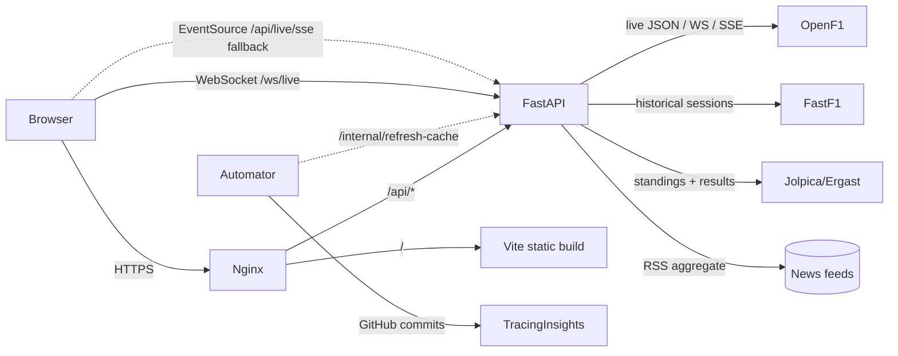

# Architecture

This document describes the runtime topology, module layout, and data flow of the F1 Demo
dashboard.

## Topology



Three runtime processes:

1. **FastAPI backend** (`backend/main.py`) — serves all `/api/*`, the WebSocket `/ws/live`, and
   the SSE fallback `/api/live/sse`.
2. **Automator daemon** (`backend/automator.py`) — long-running watcher that detects live
   sessions, polls TracingInsights for new commits, and triggers `/internal/refresh-cache` on
   the backend when new data lands.
3. **Vite frontend** (`frontend/src/`) — React 19 SPA, hydrated against the backend's REST
   surface plus the live transport (WebSocket primary, SSE fallback).

## Backend module map

```
backend/
├── main.py                    # FastAPI app composition root
├── limiter.py                 # shared SlowAPI Limiter (one instance, app-wide)
├── utils.py                   # cached_get, OpenF1 auth, FastF1 helpers, env guards
├── cache_store.py             # in-memory cache (Redis-ready)
├── automator.py               # daemon: live detection, TI polling, season rollover
├── middleware/
│   └── logging.py             # request-id + timing log
├── services/
│   ├── free_context.py        # schedule serialization
│   ├── live_stream.py         # WS poller with jittered backoff
│   ├── downsample.py          # LTTB time-series downsampling
│   └── news_service.py        # RSS aggregator with title-dedup
└── routes/
    ├── health.py              # /api/health, /api/season
    ├── schedule.py            # /api/schedule, /api/standings/*, /api/free/*
    ├── telemetry.py           # /api/laps, /api/telemetry, /api/compare (LTTB-capped)
    ├── live.py                # /api/live/{endpoint} proxy + /ws/live
    ├── live_sse.py            # /api/live/sse fallback for blocked WS
    ├── ti.py                  # TracingInsights proxy
    └── misc.py                # /api/news, /api/bios, /api/circuit-map, /internal/*
```

## Frontend module map

```
frontend/src/
├── main.jsx                   # ReactDOM.createRoot, BrowserRouter, style imports
├── App.jsx                    # route table, ErrorBoundary, ToastHost, KeyboardShortcuts
├── api.js                     # transport: fetch + ApiError + team color util
├── store/useF1Store.js        # Zustand global state
├── hooks/
│   ├── useAppInit.js          # initial fetches (standings, roster, next-race, last-results)
│   ├── useWebSocket.js        # reconnect-safe WS with jittered backoff
│   ├── useNotifications.js    # browser notifications wrapper
│   └── useKeyboardShortcuts.js
├── components/
│   ├── Sidebar.jsx            # nav with active accent bar + aria-expanded
│   ├── LiveCompanion.jsx      # docked live timing tower
│   ├── Toast.jsx              # imperative toast API + ToastHost
│   ├── Shared.jsx             # Loading, ErrorMsg, Skeleton, PageSkeleton, FlipValue
│   └── …
└── pages/
    ├── Dashboard.jsx          # glance-first landing
    ├── Drivers.jsx
    ├── Constructors.jsx
    ├── Calendar.jsx
    ├── Telemetry.jsx
    ├── Analysis.jsx
    ├── RaceDetail.jsx
    ├── NewsFeed.jsx
    └── settings/index.jsx     # theme, polling interval, notifications
```

## Data flow: a live race weekend

1. **Automator** detects an upcoming session window from the cached schedule.
2. As the session goes live, the automator flips its mode to `live` in `state.json`.
3. The frontend polls `/api/session-mode` (via `useAppInit`) and surfaces the `LiveCompanion`.
4. `LiveCompanion` opens `ws://…/ws/live`. The backend's `services/live_stream.py` polls OpenF1
   on a jittered 8-second cadence and pushes `{positions, intervals, overtakes, weather,
   race_control, timestamp}` frames.
5. If the WebSocket fails repeatedly, the frontend falls back to `EventSource('/api/live/sse')`,
   which produces the same payload shape over Server-Sent Events.
6. After the session ends, the automator polls TracingInsights for the post-session commit; on
   detection it POSTs `/internal/refresh-cache` (with `X-Internal-Secret`) so the next page
   visit reads fresh standings, lap data, and telemetry.

## Caching layers

- **Per-request TTLCache** in `utils._cache` (60 s default; key = `f"{ttl}:{url}"`). Cleared by
  `clear_request_cache()` from `/internal/refresh-cache`.
- **Pluggable `cache_store`** (in-memory by default; Redis if `REDIS_URL` is set) for the news
  aggregator and any other longer-lived cache needs.
- **FastF1 disk cache** under `backend/cache/` for historical session loads.

## Rate limits

The shared `Limiter` (`backend/limiter.py`) is referenced by `app.state.limiter` and by every
route module that decorates an endpoint with `@limiter.limit(...)`. Defaults:

| Route group              | Limit         |
|--------------------------|---------------|
| Global default           | 120 / minute  |
| `/api/standings/*`       | 30 / minute   |
| `/api/laps,telemetry,…`  | 60 / minute   |
| `/api/ti/*`              | 60 / minute   |

## Observability

- `RequestLogMiddleware` adds an `x-request-id` header and structured log on every request.
- Optional Sentry: set `SENTRY_DSN` in env; the SDK is loaded lazily and skipped if not
  installed.
- `/api/health` returns `Cache-Control: no-store` and flips `status` to `degraded` when the
  automator state file is older than 600 seconds.
